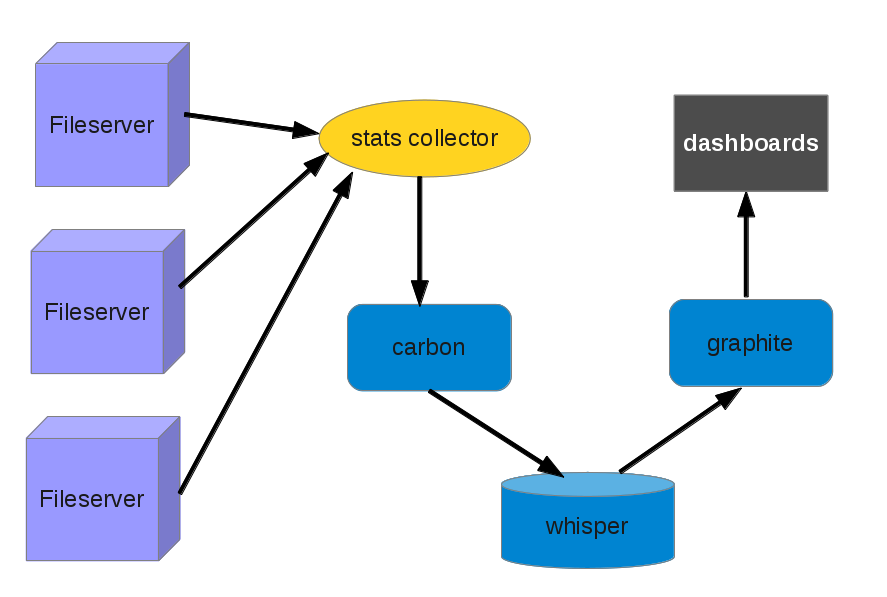
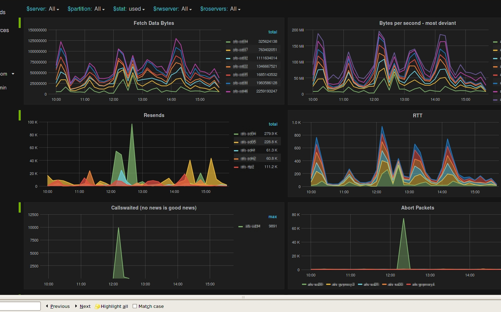
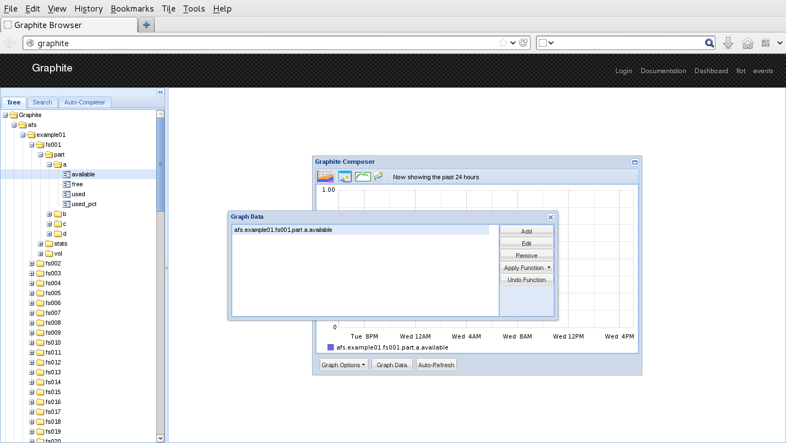
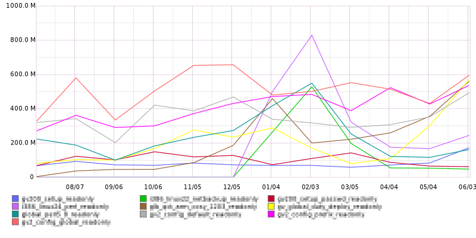
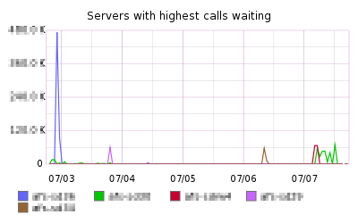
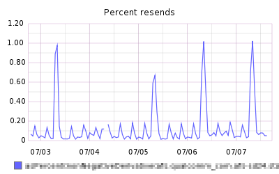
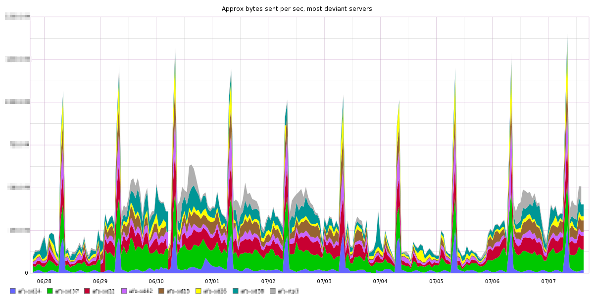

Title: Large Scale OpenAFS Performance Monitoring with Graphite
Date: August 20, 2015

Graphite
========

* Store and graph time-series metrics
* Clustering features for scaling
* Metric namespace
* Render API
* Python stack

Graphite
========

* Apache License
* Widely deployed
* Many tools that work with graphite
* I/O intensive (one file per metric!)

Graphite
========

* Carbon - daemons to accept and store metrics
* Whisper - library/file format to store time-series metrics
* Graphite - web app provides render API and basic dashboard

Deployment Experience
=====================

* Deployed to a separate server
* Partition for whisper
* Graphite RPM install almost worked, ymmv
  - some django setup headaches
  - several small patches needed
* Configure carbon data retention policies

Feeding AFS metrics to Graphite
===============================

Feeding metrics to graphite
===========================

* It is very easy to feed metrics to graphite
* Lots of tools to feed system metrics
* Metrics are sent to carbon via tcp (or udp)
* One metric per line: (path, value, timestamp)

    afs.example.afs01.rx.callswaited  31324 1420520400

> Important
>
> Data points should be feed to graphite at the same rate as
> the highest data retention frequency!

Gathering AFS fileserver metrics
=================================

* rxdebug:
    rx_GetServerDebug()
    rx_GetServerStats()
* vice stats
    GetStatistics64
* xstats
    RXAFS_GetXStats()
* xstat collections
  - 0: not implemented on the fileserver
  - 1: partial performance stats (subset of 2)
  - 2: performance stats
  - 3: callback stats
* vos partition information
* audit log fids and hosts
  - sys-v msg queue

Carbon Configuration
====================

* Retention buckets
  - regex of paths
  - frequency:duration
* Aggregation methods
  - regex of metric
  - how to rollup data

> Important
>
> Use validate-storage-schemas to check retention
> policies.

Carbon Aggregation
==================

* sum for counters (rx calls waited, packets sent)
* average for gauges (size, used percent)

> Important
>
> If you have more than one retention bucket, you must
> provide the method to aggregate data! The carbon default
> is average (gauge). Most afs metrics are counts.

Metric Namespace
================

* Decide on metric namespace conventions early
* Changes later will break render API calls
* Dot is reserved as a separator!

Example:

    afs.<cellname>.<server>.part.<part>.<metric>

Whisper files
=============

* Metrics are stored in regular files in a binary format.
* Makes it easy to archive the whole set
* Nice for "offline" analysis
* Whisper tools are handy to dump header info and raw data!

    whisper-dump /var/lib/carbon/whisper/afs/example/foo/bar.wsp

Render API
==========

* The render API is the heart of graphite!
* Rich set of functions
  - combine, transform, calculate, filter
* Rest API
* Json for data dumps
* Create and share a set of standard render calls
* Ad hoc exploration

Render Example
==============

    http://graphite/render?
      title=Fetched bytes per second
      from=-14day
      until=now
      target=
        aliasByNode(
        highestAverage(
        scaleToSeconds(
        nonNegativeDerivative(
            afs.example.*.stats.xfer.FetchData.bytes.sum),1)),2)

Grafana
=======

* Popular optional client dashboard
* Easy to deploy
* Generally nicer than the built-in graphite dashboard
* Great for ad hoc graphs and exploration

Example
=======

Example
=======

Example
=======

Example
=======

Example
=======

Example
=======

Questions
=========

This slide intentionally left blank.

