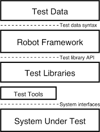
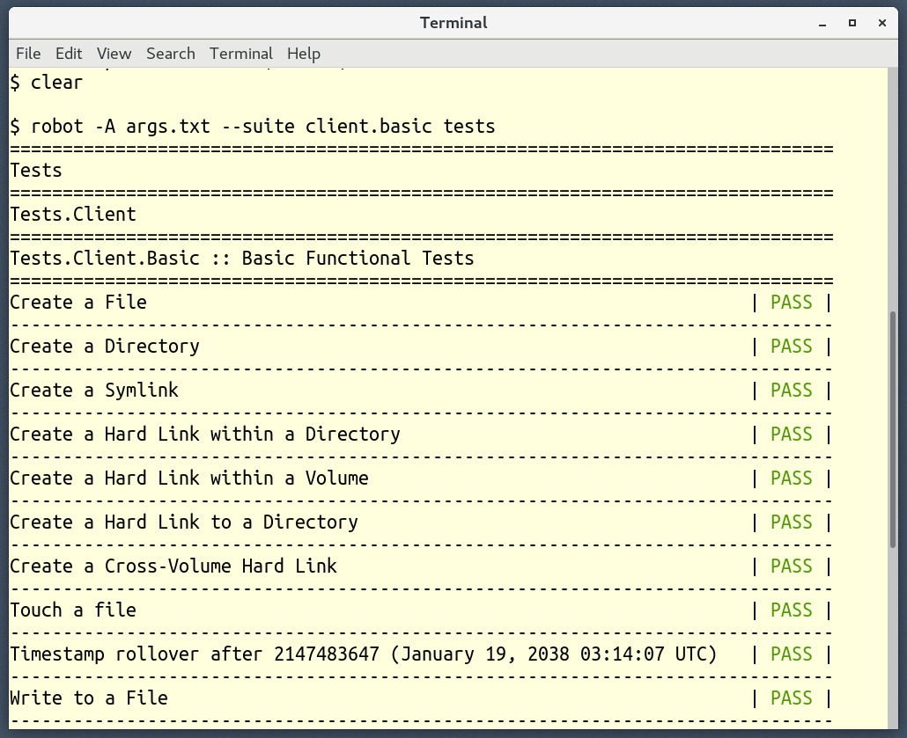
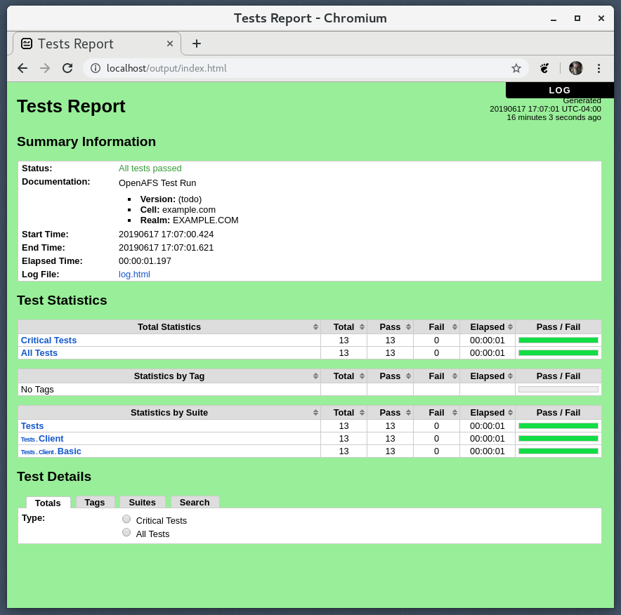
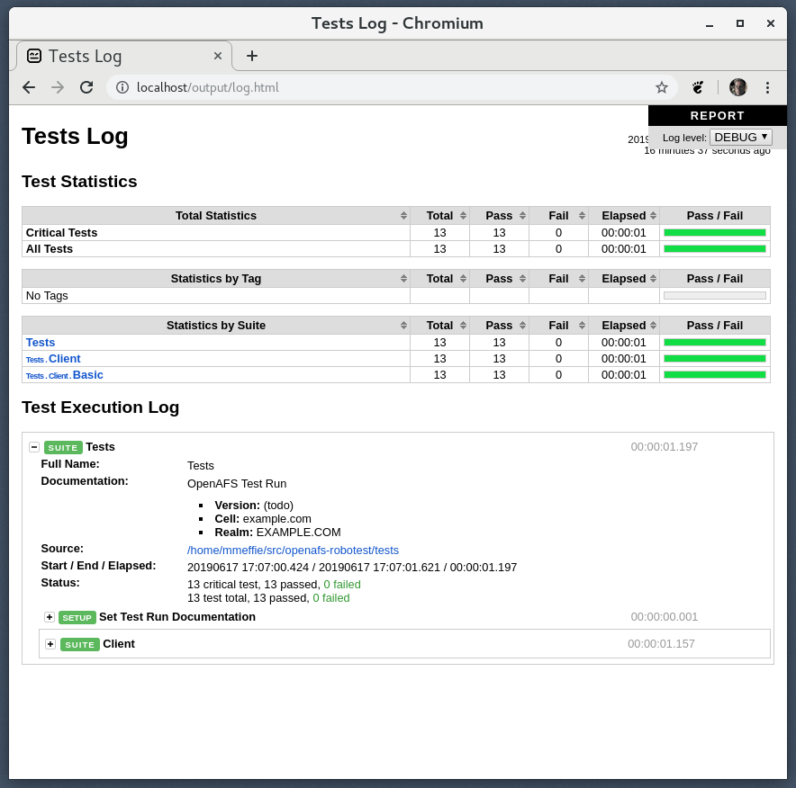
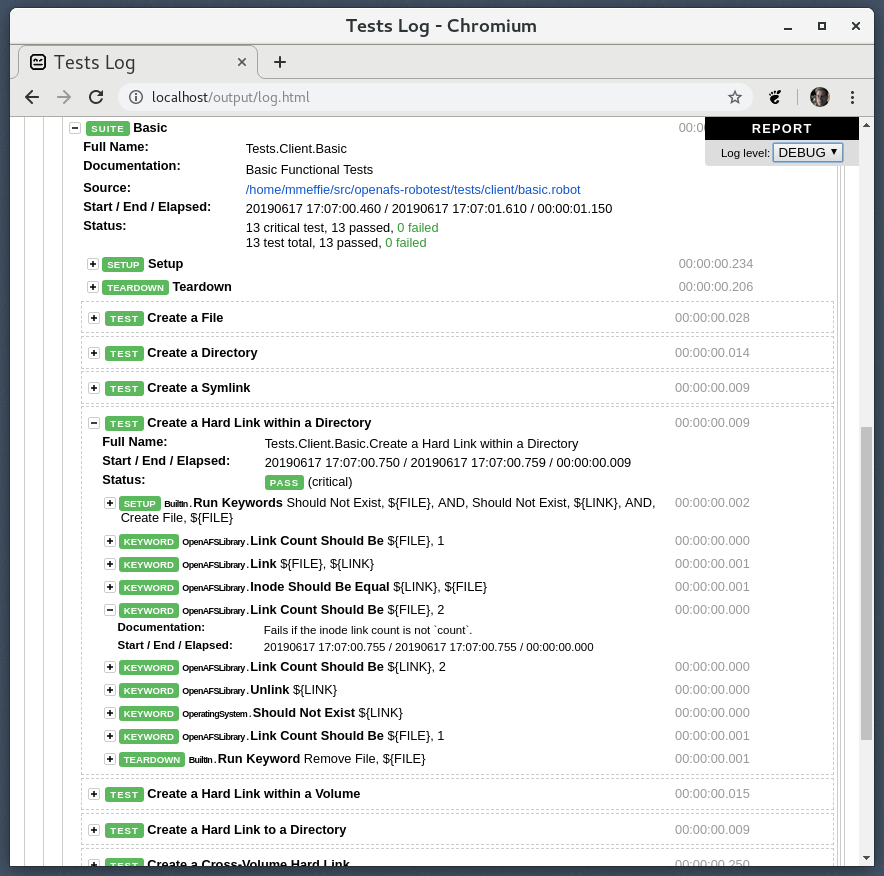

{width=70%}

{width=70%}

# Tests suites OpenAFS

* OpenAFS unit tests
    * c-based **unit tests**
    * Test Anything Protocol (TAP) style tests
    * component/function unit tests
    * run with `make check`
* Various c-based "test" programs in `/src`
    * for ad-hoc component tests
    * see `xstat_fs_test`
* OpenAFS `functionality-tests`
    * a mix of c, perl, and shell scripts
    * imported Alra project and CMU AFSTools in 2002

# OpenAFS Robotest

* An effort to create a new system level test suite
* Based on the popular Robot Framework
* Functional tests (not performance)
* Scale
    * test a trivial one-host cell
    * test many clients and servers
 * Test cells can be spun up with Ansible
    * See `ansible-openafs` roles

# Robot Framework

* `https://robotframework.org`
* General purpose acceptance test automation framework
* Tester oriented
* Well documented and active community
* Orginally developed at Nokia
* Open-source and active since 2008
* First Robot Framework conference held in 2019

# Robot Framework

* Tester oriented
* Declarative **Keyword** testing methodology
* Supports various testing styles
    * Classic style
    * Data-driven
    * Behavior-driven development (BDD)
* Test report generation (HTML and XML)
* Data driven, declarative test data
* Test execution by hierarchy and tags
* Distributed testing supported via RPC

# Robot Framework

{width=70%}

# Hello World Robot Framework Test

    *** Test Cases ***
    Valid Login
        Open Browser To Login Page
        Input Username    ${USERNAME}
        Input Password    ${PASSWORD}
        Submit Credentials
        Welcome Page Should Be Open
        [Teardown]    Close Browser

# BDD Style

    *** Test Cases ***
    Valid Login
        Given Login Page is open
        When user "demo" logs in with password "secret"
        Then welcome page should be open

    *** Keywords ***
    Browser is opened to login page
        Open Browser To Login Page
        ...
    User "${username}" logs in with password "${password}"
        Input Username    ${USERNAME}
        ...

# Robot Framework

# OpenAFS Library

* Robot Framework keywords for OpenAFS testing
* Pure python module
* Supports Python 2 and Python 3
* BSD License
* Github: openafs-contrib/robotframework-openafslibrary
* Installable with `pip`

        pip install robotframework-openafslibrary

# OpenAFS Library Keywords

Types of keywords:

* ACL
* Cache
* Command
* Dump
* Login
* PAG
* Path
* Volume
* Other

# OpenAFS Library Volume Keywords

* `Create Volume` - Create RW and RO, and mount
* `Remove Volume` - Remove RW and Clones, and unmount
* `Release Volume`
* `Volume Should Exist`
* `Volume Should Be Locked`
* `Volume Should Be Unlocked`
* `Get Volume Id`

# OpenAFS Test Data

* Functional tests for OpenAFS clients and servers
* Requires the OpenAFS Library
* BSD License
* Github: openafs-contrib/openafs-robotest
* `.robot` style test data format (text)

# OpenAFS Workload Test Suites

# OpenAFS Admin Test Suites

# Example Client Test Case

    *** Test Cases ***
    Create a Hard Link within a Directory
        [Setup]  Create File    ${FILE}
        Link Count Should Be    ${FILE}  1
        Link                    ${FILE}  ${LINK}
        Inode Should Be Equal   ${LINK}  ${FILE}
        Link Count Should Be    ${FILE}  2
        Link Count Should Be    ${LINK}  2
        Unlink                  ${LINK}
        Should Not Exist        ${LINK}
        Link Count Should Be    ${FILE}  1
        [Teardown]  Remove File  ${FILE}

# Example Server Test Case

    *** Test Cases ***
    Release a Volume
        [Setup]     Create Volume  ${v} ${h}  ${p}
        Command Should Succeed    vos addsite ${h} ${p} ${v}
        Command Should Succeed    vos release ${v}
        Volume Should Exist       ${v}.readonly
        Volume Location Matches   ${v}  ${h}  ${p}  ro
        [Teardown]  Remove Volume  ${v}

# Deployment

1. Use an existing cell, or create a new cell with Ansible
2. Setup the test control machine on a client
   * Install robotframework and openafslibrary (`pip`)
   * Install the test data (`git clone`)
   * Create RF variable and options files
3. Run tests with RF test runner `robot`

# Installation with Ansible

Ansible role `openafs_robotest`:

* Installs Robot Framework and the OpenAFS Library with `pip`
* Installs the OpenAFS Robotest test cases with `git`
* Creates RF variable files to match the test cell (paths, cell name, etc)

# Running the tests

# Output report

# Output log

# Log details

# Future

* **More** tests
* **Better** tests
* Convert `.robot` files to the newer *pipe* (|) style format
* OpenAFS Library keywords (as needed)
* Distributed testing with Robot Framework RPC

# Thank you

Questions?

