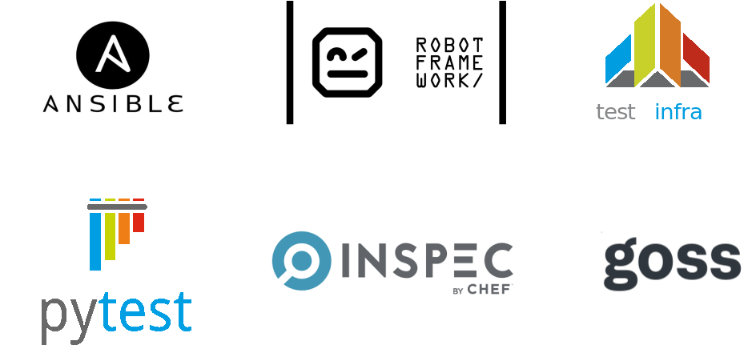

Ansible Molecule
----------------

* Ansible is an open source IT automation engine that automates provisioning,
  configuration management

* Molecule is the standard framework for testing Ansible roles and
  playbooks

* Easily spinup local "infrastructures" for testing roles and playbooks

* How can we make it easier for people to get OpenAFS up and running
  by leveraging Ansible and Molecule?

Molecule Test Cycle
-------------------

* Create one or more instances (containers or virtual machines)

* Run an Ansible playbook to setup an infrastructure

* Verify

* Cleanup and destroy instances

Drivers
-------

Verification plugins
--------------------

Molecule Scenario
-----------------

* Key concept in molecule

* Defines the number and type of platforms and how to create them

* Defines the Ansible inventory (groups and variables)

* Specifies the Ansible playbook to setup the instances

* Defines the verification method

Scenario configuration
----------------------

* Each scenario consists of a `molecule.yml` file and a set of playbooks

* The `molecule.yml` specifies everything needed to create the infrastructure
  and to verify

* Instances are created/destroyed by driver plugins or by custom scripts

* Verification is performed by verifier plugins or a custom playbook

Molecule Configuration
----------------------

    dependency:
      name: galaxy
      enabled: yes
      requirements-file: collections.yml

Molecule Configuration
----------------------

    driver:
      name: vagrant
      provider:
        name: libvirt

Molecule Configuration
----------------------

    platforms:
      - name: "myhost01"
        box: "generic/debian11"
        memory: 2048
        groups:
          - afs_fileservers
      - name: "myhost02"
        box: "generic/alma8"
        groups:
          - afs_clients
      ...

Molecule Configuration
----------------------

    provisioner:
      name: ansible
      playbooks:
        prepare: "/path/to/my/prepare.yml"
        converge: "/path/to/my/converge.yml"
      inventory:
        group_vars:
          all:
            afs_realm: "EXAMPLE.COM"
          afs_fileservers:
            afs_cell: "example.com"
            afs_install_method: "source"
            ...

Molecule Configuration
----------------------

    verifier:
      name: robotframework
      enabled: true
      group: afs_test
      libraries:
        - robotframework-openafslibrary
      ...

Molecule Configuration
----------------------

    scenario:
      create_sequence:
        - dependency
        - create
        - prepare
      converge_sequence:
        - dependency
        - create
        - prepare
        - converge
      ...

OpenAFS Ansible Collection
--------------------------

A set of Ansible Roles and Modules to deploy OpenAFS.

* Platforms: RHEL (and derviatives), Debian, openSUSE, Solaris

* MIT Kerberos KDC and workstation Roles

* OpenAFS Client and Server Roles

* OpenAFS Modules (tasks)

* Example Playbooks

* Distributed via github and Ansible Galaxy

* Automatically installed by molecule

OpenAFS Installation Methods
----------------------------

OpenAFS Ansible Collection supports a variety of installation methods.

* Install with package manager

* Upload prebuilt packages

* Checkout source code, build, and install
  - git checkout
  - gerrit checkout
  - source tarball

* Installed versions and methods my vary by instance

Molecule Converge Playbook
--------------------------

* Import OpenAFS Collection

* Install and configure Kerberos, generate keys

* Install and configure OpenAFS clients, db servers, fileservers

* Create and mount top-level volumes

* Create initial users and groups

Robot Framework Verification
----------------------------

On instances in the test group:

* Install Robot Framework

* Install required test libraries

* Download Robot Framework test cases (robot files)

* Run specified test cases

* Download report and logs

Running Molecule
----------------

    $ molecule <command> [options]

    test         Run full create/verify/destroy cycle

    list         List status of instances
    create       Start the instances
    converge     Configure instances
    login        Log in to one instance with ssh
    verify       Run automated tests against instances
    destroy      Destroy the instances

See molecule --help for the complete list.

Debugging Tips
--------------

* Check syslog on instances

* Increase verbosity and enable debug output

Example:

    export ANSIBLE_VERBOSITY=1
    export ANSIBLE_STDOUT_CALLBACK=debug

Debugging Tips
--------------

Dump Ansible variables to files:

      - run_once: true
        delegate_to: localhost
        copy:
          content: "{{ molecule_yml.driver | to_nice_json }}"
          dest: "/path/to/driver.json"
      - run_once: true
        delegate_to: localhost
        copy:
          content: "{{ hostvars | to_nice_json }}"
          dest: "/path/to/hostvars.json"

Molecule Challenges
-------------------

* Molecule documentation is limited.
  * Offset by lots of online material.

* Duplication of yaml in `molecule.yml` files
  - Base configuration files can help
  - Possible to generate files with templates (e.g. Jinja2)

* Only one driver type per scenario

* Driver/Platforms coupling makes it harder to create reusable scenarios

* login command is currently broken (Molecule version 3.6.1)

Getting started
---------------

* Install Vagrant and a virtualization provider (e.g., Virtualbox)

* Install Python3, pip3, virtualenv, cookiecutter

* Create a molecule scenario with cookiecutter

* Install molecule and ansible packages with pip3

* Run molecule

Demo: Prereqs
-------------

Install Vagrant and provider.

Install Pytyon prereqs:

    $ sudo apt-get install python3 python3-venv python3-pip
    $ python3 -m pip install --user cookiecutter

Demo: Create scenario
---------------------

Create a scenario:

    $ cookiecutter \
        --directory cookiecutter/testcell-scenario \
        https://github.com/openafs-contrib/openafs-robotest
    scenario_name [Untitled]: my-first-scenario
    ...

Demo: Install Molecule
----------------------

Install Ansible and Molecule in the scenario:

    $ cd my-first-scenario
    $ python3 -m venv venv
    $ . venv/bin/activate
    (venv) $ pip3 install -r requirements.txt

Demo: Spin up a cell
--------------------

Create a Kerberos Realm and OpenAFS cell:

    (venv) $ molecule test

Acknowledgements
----------------

Many thanks

* Ralf Brunckhorst
* Cheyenne Wills
* Mark Vitale
* Marc Schmitt, aka risson

More Info
---------

Ansible Molecule

  https://molecule.readthedocs.io/en/latest/

OpenAFS Ansible Collection

  https://openafs-ansible-collection.readthedocs.io/en/latest/

OpenAFS RobotTest

  https://openafs-robotest.readthedocs.io/en/latest/index.html

Questions?
----------

Thank you
