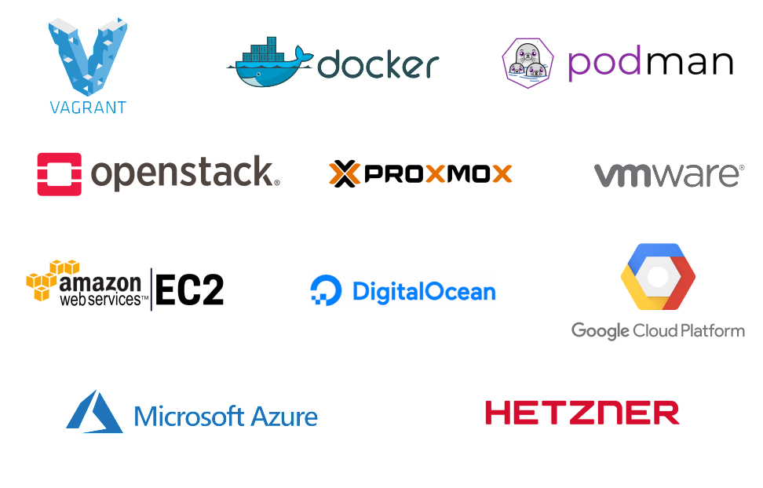

Ansible Molecule
----------------

* Ansible Molecule is the standard framework for testing Ansible roles and
  playbooks

* Easily spinup local "infrastructures" for testing roles and playbooks

* How to leverage Molecule for OpenAFS development and testing

Molecule Scenario
-----------------

* Create one or more instances (containers or virtual machines)

* Run an Ansible playbook to create an infrastructure

* Verify

* Cleanup and destroy instances

Scenario configuration
----------------------

* Each scenario consists of a `molecule.yml` file and a set of playbooks

* The `molecule.yml` specifies everthing needed to create the infrastructure
  and to verify

* Instances are created/destroyed by driver plugins or by custom playbooks

* Verfication is performed by verfier plugins or a custom playbook

Drivers
-------

Verification plugins
--------------------

* todo: verifiers logos

OpenAFS Ansible Collection
--------------------------

* MIT Kerberos KDC and workstation roles

* OpenAFS Client and Server roles

* OpenAFS modules (tasks)

* Example playbooks

* Distributed via github and Ansible Galaxy

Converge playbook
-----------------

* Import OpenAFS Collection

* Install and setup Kerberos KDC and workstations

* Install OpenAFS clients and servers

* Configure clients and servers

* Setup top-level volumes

OpenAFS Installation methods
----------------------------

* Install with package manager

* Upload prebuilt packages

* Checkout source code, build, and install
  - git checkout
  - gerrit checkout
  - source tarball

* Installed versions and methods my vary by instance

Getting started
---------------

* Install Vagrant and a virtualization provider (e.g., Virtualbox)

* Install Python3, pip3, virtualenv, cookiecutter

* Create a molecule scenario with cookiecutter

* Install molecule and ansible packages with pip3

* Run molecule

Demo
----

    $ sudo apt-get install git python3 python3-venv python3-pip
    $ python3 -m pip install --user cookiecutter
    $ cookiecutter \
        --directory cookiecutter/testcell-scenario \
        https://github.com/openafs-contrib/openafs-robotest
    scenario_name [Untitled]: my-first-scenario
    ...
    $ cd my-first-scenario
    $ python3 -m venv venv
    $ . venv/bin/activate
    (venv) $ pip3 install -r requirements.txt
    (venv) $ molecule test
    ... creates instances, creates realm and cell, runs verification, cleanup

More Info
---------

* Ansible Molecule
  https://molecule.readthedocs.io/en/latest/

* OpenAFS Ansible Collection
  https://openafs-ansible-collection.readthedocs.io/en/latest/

* OpenAFS RobotTest
  https://openafs-robotest.readthedocs.io/en/latest/index.html
