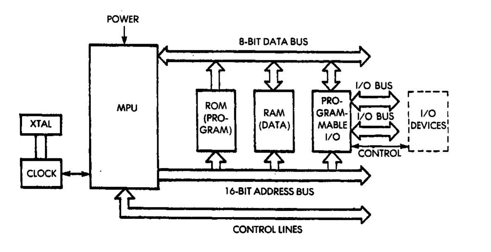

# Motivation

* Learning project
 
# Ben Eater 6502 Kit

# Additional

Not included in the BE 6502 Kit

* Clock module
* ROM programmer
* Arduino

# Todo

# Todo

# Clock module

# Power-on reset circuit

# Processor

# Read-Only Memory

# Read/Write Memory

# Address Logic Circuit

# I/O Ports

# Todo

Thanks
