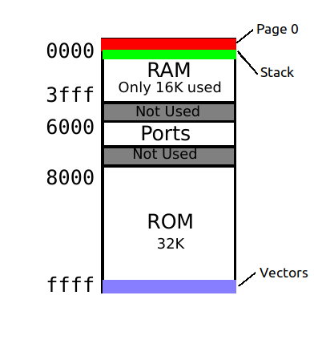

# What is this?

* Breadboard 8-bit computer
* Hobby and learning project
* Based on Ben Eater's 6502 youtube series and kit

    https://eater.net/6502

# Overview

* Hardware
* Software
* Future projects

# About the 6502

Designed in 1975

Modern version is still manufactured today as 65C22

Powered many first generation computers and game consoles

* Apple I, Apple II
* Commodore PET, Commodore VIC-20
* Atari 2600
* BBC
* Ohio Scientific

# 6502 system overview

# Hardware

* 65C02 microprocessor
* 32K x 8-bit EPROM and ZIF socket
* 32K x 8-bit RAM (only 16K addressable)
* 65C22 interface adapter (I/O ports)
* 74HC00 quad nand gate for address decoding
* 1 MHz clock module
* 0-10 Hz/single step clock circuit (555)
* Auto-reset circuit (555)
* LCD display module
* Breadboards and power supply
* EPROM burner
* Arduino Mega for testing

# Clock module

# Power-on reset circuit

# Processor

# Read-Only Memory

# Read/Write Memory

# Address Logic Circuit

# I/O Ports

# Memory Map

# Memory Map

# Registers

# Demos

* Machine language
* Assembly
