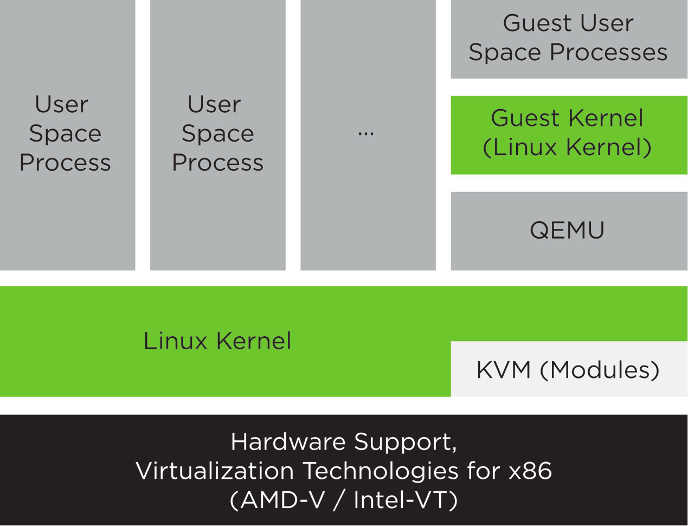

Title: Getting Started with KVM Virtualization
Author: Michael Meffie
Date: March 29, 2017

What is KVM?
=============
* KVM virtualization turns your linux server into a hypervisor
* Guests can be linux, windows, solaris, bsd, others
* Open source virtualization stack
* Foundation for OpenStack, oVirt, etc.

What is KVM
==============

Processor Requirements
======================
* Processor virtualization extensions
  - Intel VT-x (vmx flag))
  - AMD-V (smv flag)
* Check flags in /proc/cpuinfo

    grep vmx /proc/cpuinfo
    grep svm /proc/cpuinfo

Software Stack
==============

* kvm
  - virtualization extentions opcodes required
  - kernel module
* qemu
  - arch emulation
  - coupled with kvm, creates a virtual machine with low overhead
* libvirt
  - libvirtd daemon
  - api for virtualization technologies
  - virsh command line tool
* management tools
  - virt-manager gui
  - kimchi

Terminology
===========
* node - physical machine
* domain - virtual machine, guest
* image - disk image file

Getting Started
===============

    apt-get install qemu-kvm libvirt-bin virtinst
    apt-get install virt-manager # can be on your desktop
    adduser youruser kvm
    adduser youruser libvirt

Creating Guests
===============

* download an iso image
  - or give the url of installer files
* virt-manager
  - easiest
  - vnc console to setup new os
* virt-install
  - many, many, many options
  - beware of obsolete examples
  - text console, ymmv
* kimchi

Example
=======

    virt-install
    --name deb8a
    --virt-type kvm
    --os-variant debianwheezy
    --disk path=/var/lib/libvirt/images/deb8a,size=10
    --memory 1024
    --graphics none
    --location http://ftp.us.debian.org/debian/..
                dists/stable/main/installer-amd64/
    --extra-args console=ttyS0

Managing Guests
===============

virsh - command line tool for managing guests

* virsh list --all
* virsh start
* virsh shutdown
* virsh suspend
* virsh console
* and many, many, many more

Clones
======

* create a guest, install software, shutdown
* virt-clone --auto-clone
* start clone(s)
* shutdown and delete clones

Networking
==========

* NAT network
  - default network
  - guests have private IP addresses
  - built-in dhcp server
* Bridge network
  - share physical interface with the guests

NAT Network
===========

Finding your guest's IP address.

* arp
* virsh dumpxml - to find mac address
* virsh net-dhcp-leases - to find ip assigned to mac

guestfs
=======

Modify guest images before starting the vm!

* automagic provisioning
  - change grub settings
  - install packages
  - etc
* libguestfs - api
* guestfish - shell
* guestfs tools - virt-build
* http://libguestfs.org/guestfs-recipes.1.html

EOF
===

This page intentionally left blank.

