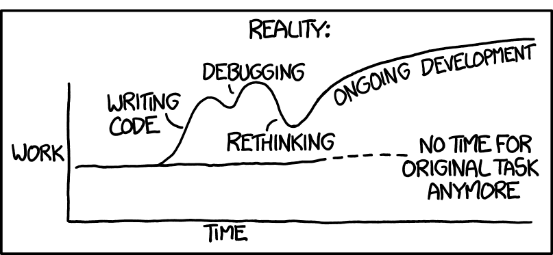

# About me

* Michael Meffie
* Principal Engineer at Sine Nomine Associates
* https://www.meffie.org

# About this talk

* How I use Ansible and Git to manage personal machines
* ... to rebuild my desktop from scratch after a reinstall
* ... to make an ephemeral virtual machines more usable

# Stuff to Manage

* Distro packages I normally use
* Third-party software - zoom, citrix
* Safely store secrets - gnupg, ssh, openvpn
* Preferences - dotfiles, gnome settings
* Projects - git repos, .envrc files, build requirements
* Custom scripts, shell aliases, environment vars
* Partitions to mount

# Keeping a secret

* Use Ansible vault to protect secrets
* Push to multiple private repos

# More like Guidelines than Rules

Keep it simple.

* Local connection
* No inventory
* Avoid variables
* Avoid conditionals
* Avoid compact YAML
* Avoid extra collections and roles
* Avoid shell scripts
* Use builtin tasks
* Simple commands when necessary
* Modularity with task imports and tags

# Rules of the Road

A bit of discipline is required.

* Avoid making manual changes
* Avoid dirty work tree, commit often
* Avoid getting out of sync, pull/push often

# Sample playbook

    - name: Main
      connection: local
      hosts: localhost
      gather_facts: false
      tasks:
        - {import_tasks: tasks/packages.yml, tags: packages}
        - {import_tasks: tasks/dotfiles.yml, tags: dotfiles}
        - {import_tasks: tasks/ssh.yml,      tags: ssh}
        - {import_tasks: tasks/gnome.yml,    tags: gnome}
        - {import_tasks: tasks/pass.yml,     tags: pass}
