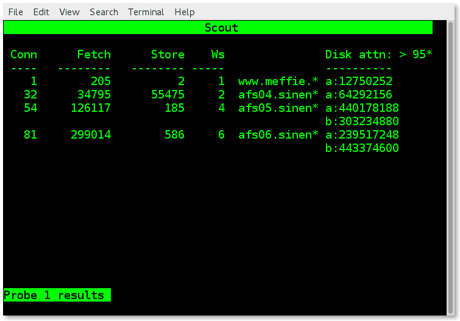
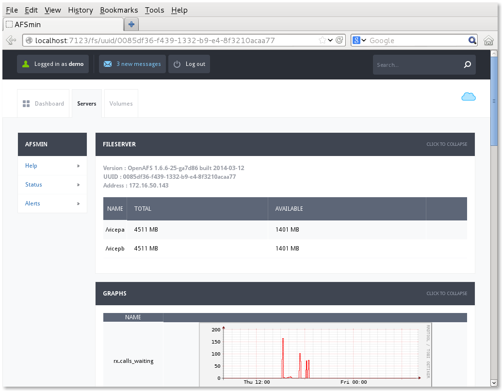

Title: AFSmin
Date: March 28, 2014

Scout
=====

AFSmin
======

AFSmin goals
============

* A better scout/afsmonitor for OpenAFS
* Distributed as an OpenAFS contrib project (on github)
  * Open source license (2 clause BSD)
  * https://github.com/openafs-contrib
* Batteries included
  * Easy to deploy and start using
  * Zero config
* Useful
  * Modern UI
  * REST API for scripting and integration

How are things going?
=====================

> What are the sort of things that would be useful to know.

* Load and performance
  - Busiest servers?
  - Busiest volumes?
  - Most active clients?
  - Load inbalance?

* Space and Quotas
  - By server, partition, volume, user?
  - Space balance?

Looking for trouble
===================

* Server troubles
* Volume troubles
  - volumes offline
  - stray locks
  - stray volumes
* Release troubles
  - are there failed releases
  - what are the releases in progress; ETA?

