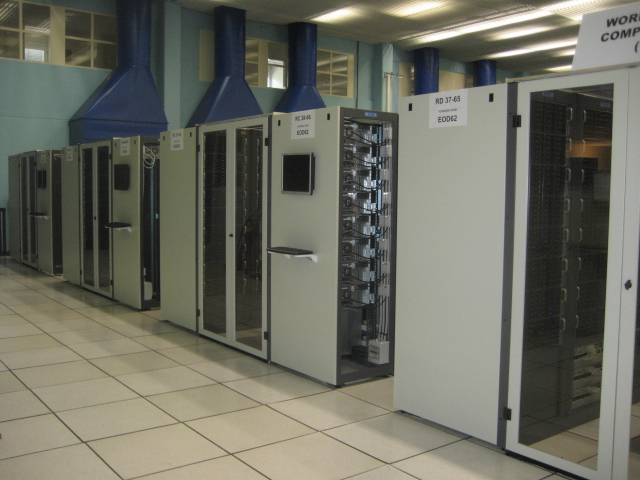
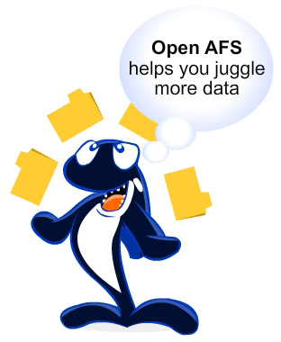

Title: Building a Private Data Cloud with OpenAFS
Author: Michael Meffie
Date: April 11, 2014

Introduction
============

* Michael Meffie, software engineer
* mmeffie@sinenomine.net
* Sine Nomine Associates
  * IT Systems Engineering
  * Commercial support for open source projects

Why
===

There are many "cloud" storage services available today.
Why would you want to build your own?

* Maybe you do not want to put your files on infrastructure you do not control?
* Maybe you like building your own stuff?
* Just because

What is OpenAFS?
================

* OpenAFS is a network filesystem
* See the same files, in the same paths, regardless of which machine you are using
* Locally mounted so files appear to be on your local system
* Aggressively cached, so files *are* on your local system, until changed
* Access Controls on directories for privacy
* Read-only content is replicated
* Clients lookup the location of file servers

Who uses OpenAFS?
=================

* Large Scale Software Distribution
  * configuration and binaries
  * finance
  * engineering
* Research
  * high energy physics: CERN, DESY
  * space exploration
  * bioinformatics, pharma
* Government
* Universities

CERN
====

Some Background
===============

* Kerberos is used for authentication
* Files are stored in file servers
* Clients use a file system driver
* A configuration service lets clients lookup file servers

File Servers
============

* One or more servers for file storage: Solaris, Linux, BSD
* These may be physical or virtual machines
* Not all the servers for a site need to be running the same architecture and operating system
* Each file storage servers should have one or more unix filesystem partitions for data and AFS-metadata storage
* The files stored in these partitions are stored in a special format and cannot be accessed directly

A cell by any other name
========================

* OpenAFS servers are administratively grouped into a collection called a 'cell'.
* The cell name in public cells matches an internet domain name.
* The naming convention for kerberos realms is to use an internet domain name, but in uppercase.
* The convention for AFS cell names is to match the kerberos realm name,

Kerberos
========

Step 1: You need an authentication service.

Kerberos
========

* MIT Kerberos, Active Directory, Heimdal
* A secure location is needed to run the Key Distribution Center
* Clocks need to be in sync (ntp)
* Create the Kerberos KDC and a setup the realm by adding users.
* Create the Service Key for OpenAFS (AES, etc.)

OpenAFS Database Servers
========================

Step 2: Configuration servers

* Install openafs server packages (apt, yum) and start the configuration servers
* Protection "database" maintains the list of users and groups for access control
* Volume Location "database" maintains the list of file servers and file sets (volumes)

> Note:
> The database services are replicated for reliability. Normally different instances
> are installed, so if one or more goes down, the service is still available.

OpenAFS Fileservers
===================

Step 3: File servers

* Real or virtual machines can be used
* Files and metadata are stored in dedicated partitions (up to 255 of them)
* More file servers can be added as more space is needed
* Install openafs server packages (apt, yum, etc) and start the file servers

OpenAFS client
==============

Step 4: Clients

* Linux, MacOS, Windows, iPhone clients are available
* Packaging varies by client
* Clients will also need the Kerberos client software, if authenticated access is needed.

Read/Write Files
================

* Access controls determine who has access to files
* Multiple users can write at the same time, but just like linux, the last writer wins
* Files are organized into sets (called volumes)
* The file sets (volumes) can be moved from server to server
  * even while users are *writing* to files

Read-Only Files
===============

* An important and common use case: files written once
* This includes files such as programs, media, experimental data
* OpenAFS provides read-only file replication for these types of files
* Files are groups into sets (called volumes)
* The read-only file sets are atomically distributed to multiple fileservers
* Clients will fail over to other servers as needed

The good
========

* open source implementation
* wide range of platforms supported
* global namespace
* location transparency
* client-side caching
* read-only replication
* access control lists
* kerberos integration

The bad
=======

* some ancient limitations
* network performance
* weak native crypto
  * use openvpn
  * gssapi work in progress
* udp only
  * tcp data transfer is experimental
* linux: out-of-tree linux kernel module
* NAT pain

Questions
=========

