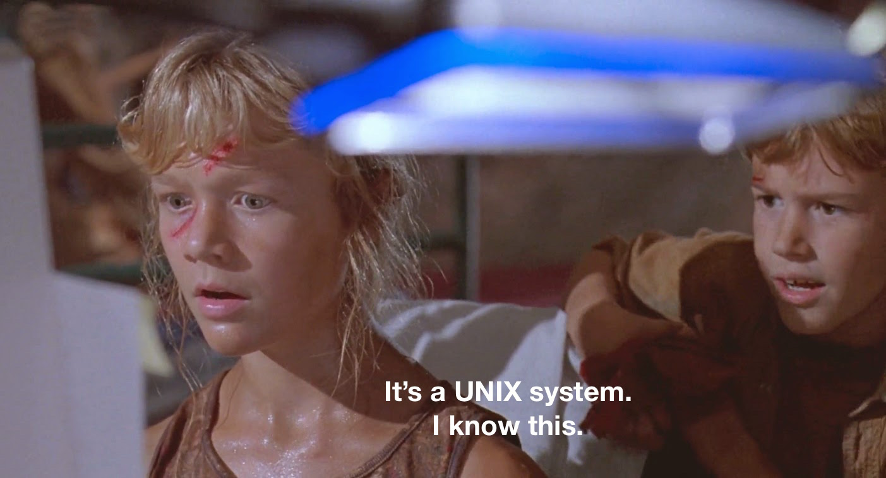
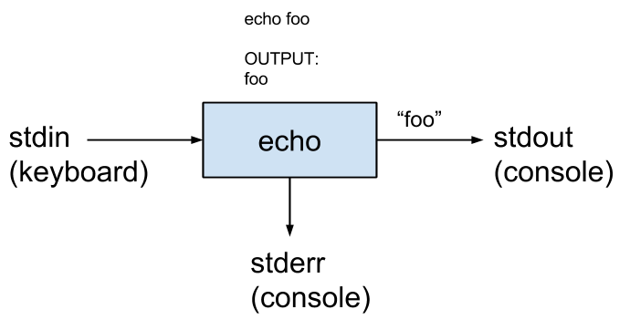
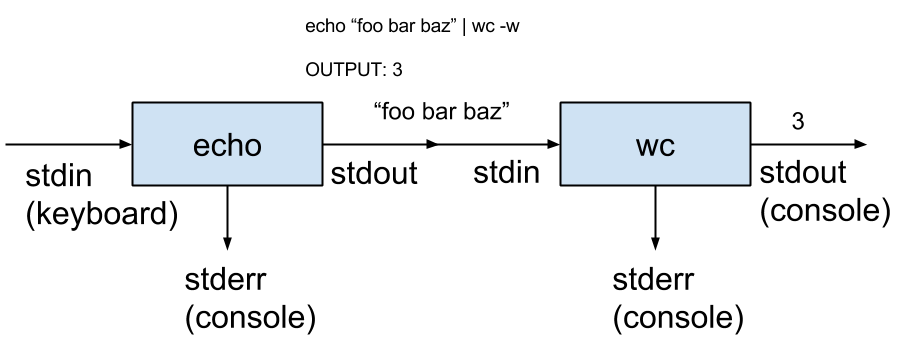

Title: Mastering bash: one-liners to scripts
Author: Michael Meffie
Date: February 17, 2016

Mastering bash
==============

* About the Terminal
* Using the Shell
* Pipelines: The Unix Way
* Variables, Flow, Functions, and more
* Writing Scripts

Part 1: About the terminal
==========================

Text mode
=========

* Terminal
* Console
* Shell
* Text mode
* Command line
* Command prompt

The benefits of text
====================

Communication

- with the machine
- with other people
- over time
- between programs

Bash is a shell
===============

* Text-mode user interface
* Run commands and displays results
* The shell is a regular user space process
* bash is the Bourne Again shell

> Historical Note: The first shell was called the Thompson shell (sh). Other
> shells followed; the Bourne shell, Korn shell (ksh), C shell (csh), Zee/Zed
> shell (zsh), and many others. Bash is a modern re-implementation of the Bourne
> shell with features from others as well.

Using the shell
===============

    $ ls

    $ cp file-one file-two

    $ rm -f file-one

    $ /path/to/command-name --some-option some-value some-arg

> Search Path: The shell will search for commands in the PATH environment
> variable. The arguments and options, if any, depend on the particular
> command.

Basic commands
==============

* ls - list directories
* cd - change current working directory
* pwd - print working directory
* cp - copy files
* mv - rename or move file or directory
* rm, rmdir - remove file, remove directory
* find - search for files and directories
* touch - create an empty file, update access time
* ln - create hard links, symbolic links
* chmod - change file permissions
* echo - display a line
* file - show the type of file
* man, info - manual pages

Redirection
===========

* Use '>' to redirect output to a file instead of the terminal.
* Use '>>' to redirect and append to a file.
* Use '<' to redirect from a file to input.

    $ ls > myfile

    $ ls >> myfile

    $ mail -s hello < myfile

Filename expansion
==================

The shell will expand asterisk and question marks to the files in the given
directory;  called 'globing', sometimes called 'wildcards'.

    $ echo *
    examples images mastering-bash.md mastering-bash.pdf

    $ echo mastering*
    mastering-bash.md mastering-bash.pdf

    $ echo example?
    examples

Brace expansion
===============

Brace expansion can save a lot of keystrokes.

    $ echo {one,two}fish
    onefish twofish

    $ echo {a..f}
    a b c d e f

    $ echo {0..9}
    0 1 2 3 4 5 6 7 8 9

    $ convert unix.{gif,png}
    expands to -> convert unix.gif unix.png

Tips
====

* tab completion is your friend
* Up arrow to retrieve last command
* Use history to see last commands, !(number) to avoid retyping.
* Control-a, Control-e - move to beginning, end of line
* alias long commands or frequently used arguments
* command -h
* man -k

Your turn
=========

> Exercise: Use the basic commands to list the files and directories in your
> home directory, create new files, copy, and rename files.
>
> Create new directories, change the working directory, and remove directories.

Part 2: Pipelines: The Unix Way
===============================

A plan
======

A plan for software components:

1. Make each program do one thing well.
2. Expect the output of every program to become the input to another, *as yet unknown*, program.
3. We should have some ways of coupling programs like a garden hose, screw in another segment when it becomes when it becomes necessary to massage data in another way.

M. Doug McIlroy, 1964

The unix toolkit
================

* cat - catenate, e.g., output one or more files
* grep - print lines matching a pattern
* head, tail - print the first, or last so many lines
* tr - translate or delete individual characters
* sort - sort lines
* uniq - remove duplicate lines
* cut - parse lines
* wc - count chars, words, and lines
* nl - number lines
* sed - stream editor
* awk - stream processor
* ssh - send data over a secure connection

Standard streams
================

            Loop until end of file:
                 read line from stdin
                 Process line
                 Write line to stdout

Pipelines
=========

Example: More shell, less egg
=============================

> Task:
> Read a file of text, determine the n most frequently used words, and print
> out a sorted list of those words along with their frequencies.

Example: More shell, less egg
=============================

Doug McIlroy's solution:

        tr -cs A-Za-z '::newline::' |
        tr A-Z a-z |
        sort |
        uniq -c |
        sort -rn |
        sed ${1}q  # or head

Example: More shell, less egg
=============================

1. Make one-word lines by transliterating the complement (-c) of the alphabet into newlines (note the quoted newline), and squeezing out (-s) multiple newlines.
2. Transliterate upper case to lower case.
3. Sort to bring identical words together.
4. Replace each run of duplicate words with a single representative and include a count (-c).
5. Sort in reverse (-r) numeric (-n) order.
6. Pass through a stream editor; quit (q) after printing the number of lines designated by the script's first parameter.

Example: Secret Key
===================

> Task:
> Set the secret key value in a settings file. It should
> be a random string of letters and numbers, 40 in length.

Example:

    cat settings.py
    SECRET_KEY = 'OMGtDtApoPYUke3NUZfcHnNIV7jZ9jjtjDFd6Hl6'

Example: Secret Key
===================

Idea: The /dev/urandom file generates a stream of random bits.

        cat /dev/urandom
        ... random non-printable bytes ...

The random bits need to be converted to 40 alpha-numeric characters.

Example: Secret Key
===================

    cat /dev/urandom | tr -dc 'a-zA-Z0-9' | head -c40

    KEY=$(cat /dev/urandom | tr -dc 'a-zA-Z0-9' | head -c40)
    echo "SECRET_KEY = '$KEY'" > settings.py

1. Print stream of random bits.
2. Select alpha-numeric chars by deleting (-d) the complement (-c) of alpha-numeric.
3. Print the first 40 chars (-c).
4. Use command substitution to put the random key into $KEY.
5. Print settings file with the random key.

Example: Game Night
===================

> Task:
> Game night is on the first Wednesday of the month. Print the dates of this
> year's game nights.

Example: Game Night
===================

Idea: cal shows the calendar dates. The man page shows ncal for "narrow" format.

        ncal 2 2016
            February 2016
        Su     7 14 21 28
        Mo  1  8 15 22 29
        Tu  2  9 16 23
        We  3 10 17 24
        Th  4 11 18 25
        Fr  5 12 19 26
        Sa  6 13 20 27

We can grep for lines starting with 'W' to show the dates of the Wednesdays,
e.g., the first is on the 3rd, second on the 10th.

Example: Game Night
===================

        for m in {1..12}; do ncal $m 2016; done |
        grep '^W' |
        nl |
        awk '{print $1 "/" $3}'

1. Run ncal 12 times; months 1 to 12.
2. Find lines for Wednesdays.
3. Number the lines, 1 to 12.
4. Print the month and day.

Example: Jumble
===============

> Task:
> Solve a word puzzle. You are given a list of commons words in which
> the letters are scrambled. Find the original words.

Some examples:

        kace  -> cake
        palep -> apple
        sohue -> house

Example: Jumble
===============

Idea: Generate a signature for each word by sorting the letters of the word and
then use the signature to do a direct lookup.  Let's say the dictionary
contains the words,

        apple
        cake
        house

Then, sort the letters of each word to generate an index,

        aelpp   apple
        acek    cake
        ehosu   house

Sort the letters of the puzzle word and then search for the line(s)j:
matching the signature.

        palep ---> aelpp ---> apple

Example: Jumble
===============

The '/usr/share/dict/words' file contains a dictionary of words for the current
locale.  To make this example simpler, let's filter out the proper nouns,
possessives, and accented characters. (We use the locale "all" variable to
configure grep to use plain ASCII.)

    $ LC_ALL=C grep '^[a-z]*$' /usr/share/dict/words > words

Example: Jumble
===============

The next and primary challenge is to find a way to sort the letters of a word.
Here's an idiomatic perl one-liner;

    $ echo apple | perl -lane 'print sort split //'
    aelpp

Let's use this to generate the keys for each word;

    $ cat words | perl -lane 'print sort split //' > keys

Next, combine the keys and the words into an index file;

    $ paste -d: keys words > index

Example: Jumble
===============

We make a function to generate the key, and then use the key to search
the index;

    $ key() { echo $1 | perl -lane 'print sort split //'; }
    $ key palep
    aelpp
    
    $ grep "^aelpp:" index
    aelpp:apple
    $ grep "^$(key palep):" index | cut -d: -f2
    apple
    
    $ unjumble() { grep "^$(key $1):" index | cut -d: -f2; }
    $ unjumble palep
    apple

Example: Jumble
===============

Summary

    $ LC_ALL=C grep '^[a-z]*$' /usr/share/dict/words > words
    $ cat words | perl -lane 'print sort split //' > keys
    $ paste -d: keys words > index
    $ key() { echo $1 | perl -lane 'print sort split //'; }
    $ unjumble() { grep "^$(key $1):" index | cut -d: -f2; }
    
    $ unjumble pelpa
    apple

Part 3: Variables, Flow, Functions, and more
============================================

Variables
=========

* Exported vs non-exported.
* No space between name and equals.
* No $ when defined, but leading $ to expand.

    MYVAR="some value"
    MY_OTHER_VAR=6

    echo $MYVAR
    echo ${MY_OTHER_VAR}example
    echo "$MYVAR expands in double quote"
    echo '$MYVAR does not expand in single quote'
    echo $?  # last exit code

Conjunctions
============

* and - run second only if first succeeds,
* or - run second only if first fails,

    first-command && second-command
    first-command || second-command

Test
====

    test EXPRESSION

    test -f myfile   # file exists?
    test -d mydir    # dir exists ?
    test -z "$x"     # is string empty?

    test -f myfile -a -d mydir    # both exist?
    test -f myfile -o -d mydir    # either exist?

Conditions
==========

    if command
    then
        commands-on-ok
    else
        commands-on-fail
    fi

    if test -f myfile; then
        echo "file found!"
    fi

    if [ -f myfile ]; then
        echo "file found!"
    fi

Loops
=====

    for x in list
    do
        commands-to-run
    done

    while command
    do
        commands-to-run
    done

Case
====

    case $var in
    first-pattern )
        commands-to-run
        ;;
    second-pattern )
        commands-to-run
        ;;
    esac

Functions
=========

Shell functions are like little scripts.

    myfunction() {
        echo "first arg is $1"
        ...
    }

    myfunction myarg  # "call" the function

Subshells
=========

The shell can invoke the shell!  The subshell acts like
a single command but creates a new shell that runs one or
more commands.

Example,

    ( echo "hello"; echo "world" ) > hello.txt

Here's an idiomatic command to move a full tree.

    ( cd src && tar cf - ) | ( cd dst && tar xf - )

Sourcing
========

Sourcing is a way to include variable and function definitions
into the current shell.

    cat myvars
    >> MYVAR=123

    . myvars
    echo $MYVAR
    >> 123

Part 4: Writing Scripts
=======================

About scripts
=============

* The shell is a command too, and can get it's input from stdin or a file.
* Automation means more error checking and handling.
* Write shell scripts when the task mostly calls for running commands, not processing data.
* Use bash -x to debug.
* Use chmod to make the script executable.

Anatomy of a script
===================

A typical script layout:

    #!/bin/bash
    # <description>
    <bash options, e.g., set -e>

    <source config and functions>

    <functions>

    <command-line-option-handling>

    <call-the-functions>

Example: Quest
==============

> Task:
> In this example we will be writing a small text based adventure
> game in a shell script. Our script will accept simple text commands
> from the terminal and print a description to the player.

Example: Quest
==============

    ./quest
    You are in small, dusty, and dimly lit chamber.  A passage
    leads north.
    There is a set of silver keys here.
    There is a brass lamp here.
    > north
    You are in a dusty old library. Many old books are strewn
    about the floor and are stacked on shelves that line the
    wall. You see a doorway to the south, east, and west.
    There is an old book here.
    There is a wand with the word xyzzy inscribed on it here.
    > take wand
    You now have a wand with the word xyzzy inscribed on it.

Idea for Rooms
==============

Concept: Use files and cat for the location descriptions.

1. Create a directory called 'map' and subdirs 0 to 3.
2. In each sub dir create a file called 'desc' with a brief room description.
3. Set the variable 'room' to 0.
4. Show the room description with cat map/$room/desc.
5. Change room number and show the room descriptions with cat.

Idea for Navigatation
=====================

Concept: Use a small file that lists directions and the next room.

1. Create a file called exits in each map/(room).
2. Put lines in the exit files that show the next room for directions.
3. Use grep and cut to get the next room for a given direction.

Example:

    north 1
    east 2

Handling user input
===================

1. Start a script called 'quest'.
2. Make it executable.
3. Add a main loop to read input and then print it.
4. Exit when the user enters 'quit'.

Handling user input
===================

        while read words
        do
            case $words
            quit)
                break
                ;;
            *)
                echo "you said $words"
                ;;
            esac
        done

Coding look
===========

1. Use a variable to keep track of the current room.
2. Write a function to display the description of the current

Coding navigation
=================

1. Write a function to navigate to the next room.
2. Show the new room description as we move from room to room.
3. Add new verbs in the main loop.

Idea for items
==============

Everything in unix is a file.

1. Create an 'items' directory for each room.
2. Create an 'items' directory for the character.
3. Add items by creating files for each item. The name of the file is the short
   name of the item, and the contents is the description.
4. Use cat to display the item descriptions for the rooms.
5. Use mv to take and drop items.

Coding items
============

1. Write functions to take and drop items.
2. Write a function to list your inventory.
3. Add new verbs in the main loop.

Add some magic
==============

1. If the char has the wand and says 'xyzzy', teleport back to room 0.

EOF
===

This page intentionally left blank.

