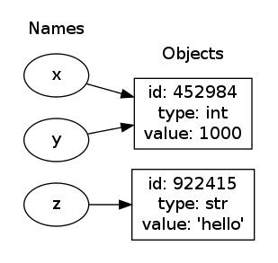

Title: Getting Started With Python
Author: Michael Meffie
Date: August 26, 2015

Getting Started with Python
===========================

* Part 1: Introduction to Python
* Part 2: A quick tour of Python modules
* Part 3: Workshop

Part 1: Introduction to Python
==============================

* What is Python and why should I use it?
* How Python manages your data
* Form and function

Why Python?
===========

* Productivity
 * Clear Syntax
 * Batteries Included
 * Portable
 * Dynamic Typing
* Scales
 * Extensible
 * Small to Large Projects
 * Beginners to Experts
 * Small Scripts to Large Systems
* And more
 * Free software
 * Fun

What is Python
==============

* Language
* Runtime Environment
 * compiler
 * byte code engine (PVM)
 * CPython (reference), Jython (java), IronPython (.NET)
* Libraries
 * Comprehensive Standard Library
 * 3rd Party Libraries
 * Make your own libraries (in python or c)
* Programming Culture

Python Versions
===============

* Python 3.x - the future
* Python 2.x - classic, but a large code base
* Python is slowly migrating to Python 3.

> Use Python 3 unless you have good reasons not to.

A taste of Python
=================

    import time
    
    print("Commencing countdown!")
    for countdown in range(10, 0, -1):
        print(countdown)
        if countdown == 3:
            print("...almost there!")
        time.sleep(1)
    
    print("RELEASE THE CATS!")
    # your code here...

Objects, Objects Everywhere
===========================

    x = 1000
    y = 1000
    z = 'hello'

Objects, Objects Everywhere
===========================

    y = 'hello'

Data Types
==========

* Numbers
 * Integers (arbitrarily large)
 * Floating Point
 * Complex
* Strings
 * Unicode (immutable)
* Lists
* Dictionaries
* Others: None, Tuples, Sets, and more ...

Comparisons
===========

    a = 1
    b = 2
    c = 3
    a == b           -> False
    a != b           -> True
    a < b            -> True
    a is b           -> False
    a < b and b < c  -> True
    a < b < c        -> True

Strings
=======

    "double quotes enclose a string"
    'single quotes work as well'
    """multi line strings are
    also supported with
    triple quotes."""

Strings
=======

* len("my string") -> 9
* format()
* plus operator to catenate

    if x == "some value":
        print("x is some value")

Lists (part 1 of 4)
===================

* Variable length
* Zero based
* Mutable
* Nestable

    example = ['hello', 1, 2.0]
    len(example) -> 3

Lists (part 2 of 4)
===================

    letters = ['a', 'b', 'c']
    len(letters) -> 3
    letters[0]   -> 'a'
    letters[1]   -> 'b'
    letters[2]   -> 'c'
    letters[-1]  -> 'c'
    'a' in letters  -> True

Lists (part 3 of 4)
===================

    letters = ['a', 'b', 'c']
    letters.append('d')
    len(letters) -> 4
    letters[3]   -> 'd'
    letters[-1]  -> 'd'
    letters.insert(0, 'z') -> ['z', 'a', ...]

Lists (part 4 of 4)
===================

    letters = ['a', 'b', 'c', 'd']
    letters[0:2] -> ['a', 'b']
    letters[1:] -> ['b', 'c', 'd']
    letters[:]  -> ['a', 'b', 'c', 'd']

Loops
=====

* The for keyword is used for loops
* The while keyword is seldom used in python
* Lists are *iterable*

    letters = ['a', 'b', 'c']
    for letter in letters:
        print("letter", letter)

Dictionaries
============

* Key/Value pairs
* Keys are unique

    example = {'name': 'Mike', 'age': 29}
    example['name'] -> 'Mike'
    example['age']  -> 29
    example['weight'] -> KeyError!
    
    for key in example:
        print(key, example[key])

Functions
=========

    def greet(msg):
        """Print a message to the user."""
        print(msg)
    
    greet('hello world')

Imports
=======

* Use the import keyword to import modules into your program.
* Searches the Python path for modules
* Use the dot operator to access names in the module namespace

    import os
    os.uname() -> ('Linux', 'mantis', ...
    
    from os import uname        # shortcut
    uname() -> ('Linux', 'mantis', ...
    
    from os import uname as u   # alias
    u()

Classes
=======

* Uppercase name
* dunder init function to initialize the instance
* use underscores to indicate "private methods"

    class Frobinator(object):
        """Frobinate the razzle."""
        def __init__(self, x):
            self.x = x
        def foo(self, y):
            """Foo the frob."""
            ...
        def _bar(self):
            ...
    f = Frobinator(1000)
    f.foo(2000)

Modules
=======

* Larger projects are organized by modules.
* Modules are simply python files.
* Sets of modules in a directory are called packages.
* A special init file tells python the directory is a package.

Part 2: A tour of Python modules
================================

* Command Line Arguments
* String Handling
* Files and Directories
* Dates and Time
* Running Commands
* Databases
* Email
* GUI
* Web Automation
* OpenOffice Automation

Command Line Arguments
======================

    import sys
    for arg in sys.argv:
        print(arg)
    ...
    import argparse
    p = argparse.ArgumentParser()
    p.add_argument(
       '-c', '--cats',
       dest="cats", type=int,
       help="number of cats to release")
    args = p.parse_args()
    if args.cats > 0:
       ...

String Handling
===============

    split(x, ",")
    ",".join(a_list)
    x.replace('cat', 'dog')
    y.strip()
    "%s style format" % ('classic',)
    "{0} style".format('modern')
    "hello" in x
    for char in list("hello"):
        print char

Files and Directories
=====================

    import os
    import glob
    import shutils
    
    w = os.path.join(os.path.dirname(x), y, z)
    if os.path.isdir(w):
        for dirent in os.listdir(w):
           ...
    for root,dirs,files in os.walk(w):
       ...
    for x in glob.glob('/home/mike/*.py'):
       ...
    shutil.copytree(a, b)

Files and Directories
=====================

    try:
        f = open(somefile)
        for line in f.readlines():
            print("got line:", line.strip())
    except:
        print("whoa!")
    finally:
        f.close()

    with open(somefile) as f:
        lines = f.readlines():

Dates and Time
==============

    import datetime
    
    today = datetime.date.today()
    one_day = datetime.timedelta(days=1)
    yesterday = today - one_day
    tomorrow = today + one_day

Running Commands
================

    import subprocess

    rc = subprocess.call(['/usr/bin/whoami'])
    output = subprocess.check_output(['/bin/ps', '-e', '-f'])

Databases
=========

    import MySQLdb
    import MySQLdb.cursors
    
    db = MySQLdb.connect(host='db', user='myname',
                         passwd='secret')
    db.cursor.execute("SELECT somecol FROM sometable")
    rows = db.cursor.fetchall()

Email
=====

    # Read a message from an IMAP4 server
    import email
    import imaplib
    import imaplib_connect

    c = imaplib_connect.open_connection()
    c.select('INBOX', readonly=True)
    t, data = c.fetch('1', '(RFC822)')
    for response_part in data:
        msg = email.message_from_string(response_part[1])
        for header in ['subject', 'to', 'from']:
            print('%-8s: %s' % (header.upper(), msg[header]))
    c.close()
    c.logout()

GUI
===

    import Tkinter
    class Example(Tkinter.Frame):
        def __init__(self, parent):
            Tkinter.Frame.__init__(self, parent,
                                   background="white")
            self.parent = parent
            self.initUI()
        def initUI(self):
            self.parent.title("Simple")
            self.pack(fill=Tkinter.BOTH, expand=1)
    def main():
        root = Tkinter.Tk()
        root.geometry("250x150+300+300")
        app = Example(root)
        root.mainloop()

Web Automation
==============

     # A tiny web server
     import SocketServer
     import SimpleHTTPServer
     address = ('localhost', 8000)
     handler = SimpleHTTPServer.SimpleHTTPRequestHandler
     httpd = SocketServer.TCPServer(address, handler)
     httpd.serve_forever()

Web Automation
==============

    $ sudo pip install mechanize  # non-std-lib
    ...
    # A simle robot.
    import mechanize
    
    b = mechanize.Browser()
    response = b.open('http://www.sinenomine.net')
    for link in b.links():
        print(link.text, link.url)

Web Automation
==============

    import bs4
    
    def scrape_table(page):
        soup = bs4.BeautifulSoup(page, from_encoding='utf-8')
        table = soup.find('table', attrs={'class': 'mytable'})
        tbody = table.find('tbody')
        data = []
        for tr in tbody.find_all('tr'):
            row = []
            for td in tr.find_all('td'):
                row.append(td.text.strip())
            data.append(row)
        return data

OpenOffice Automation
=====================

    import pyoo

    PORT = 22002
    desktop = pyoo.Desktop('localhost', PORT)
    doc = desktop.open_spreadsheet(myfile)
    sheet = doc.sheets[0]
    sheet[3,2].value = int(number)
    sheet[9,2].value = date.strftime("%B %Y")
    doc.save(myfile, filter_name="MS Excel 97")
    doc.close()

Part 3: Workshop
================

Census provides a REST based API freely available to the public.  We will be
creating a small Python program to access the US Census API. You'll need to
request a free developer key.

In this workshop, we will create a program to query the census API and print
the states which had the largest population in 2010.

    http://www.census.gov/developers/
    http://opengeocode.org/tutorials/USCensusAPI.php

Census API
==========

The following URL will return the population totals of each state and the
corresponding state name:

    http://api.census.gov/data/2010/sf1?
       key=...&get= P0010001,NAME&for=state:*

The following URL will return the population total for Oregon and the
corresponding state name:

    http://api.census.gov/data/2010/sf1?
       key=...&get= P0010001,NAME&for=state:41

The API returns its responses in JSON format.

    [["P0010001","NAME","state"],
    ["3831074","Oregon","41"]]

Task 1
======

* Request a developer key from www.census.gov/devlopers.
* See the "request a key" on the terms of service page.
* You will receive a key in your email in about 5 minutes.
* Save your key in text file, we will use it later.

Task 2
======

* Write a function to read your key from a file.

Task 2 (answer)
===============

    import os
    
    def read_api_key():
        filename = os.path.join(os.getenv("HOME"),
                   ".census-api-key")
        with open(filename) as keyfile:
            key = keyfile.read().strip()
        return key

    def main():
        key = read_api_key()
        print(key)

    main()

Task 3
======

* Write a python program that will request a url and print
  the response text.
* Hint: use urllib.request

Task 3 (answer)
===============

    import os
    import urllib.request
    ...
    def request_url():
        url = "http://www.example.org/"
        request = urllib.request.urlopen(url)
        text = request.read().decode()
        return text
    def main():
        key = read_api_key()
        text = request_url()
        print(text)
    main()

Task 4
======

* Use example URL to request the population totals from each
  state in 2010.
* Print the json result

Task 4 (answer)
===============
    ....
    import urllib.request
    ....
    def request_census_data(key):
        url = "http://api.census.gov/data/2010/sf1?"+
              "key={0}&"+
              "get=P0010001,NAME&for=state:*".format(key)
        request = urllib.request.urlopen(url)
        text = request.read().decode()
        return text
    def main():
        key = read_api_key()
        text = request_census_data(key)
        print(text)
    main()

Task 5
======

* Convert the json to a python list!

Task 5 (answer)
===============

    ...
    import json
    ....
    def request_census_data(key):
        ...
        request = urllib.request.urlopen(url)
        text = request.read().decode()
        data = json.loads(text)
        return data
    def main():
        key = read_api_key()
        data = request_census_data(key)
        print(data)
    main()

Task 6
======

* Print the names of the ten states which have the largest
  population!

Task 6 (answer)
===============

    ....
    def get_states(data):
        states = []
        for population,state,fips in data[1:]:
            row = (int(population), state)
            states.append(row)
        return sorted(states, reverse=True)
    def main():
        key = read_api_key()
        data = request_census_data(key)
        states = get_states(data)
        print(states[:10])
    main()

And now for something completely different.
===========================================

    import this
    The Zen of Python, by Tim Peters
    
    Beautiful is better than ugly.
    Explicit is better than implicit.
    Simple is better than complex.
    Complex is better than complicated.
    Flat is better than nested.
    Sparse is better than dense.
    Readability counts.

